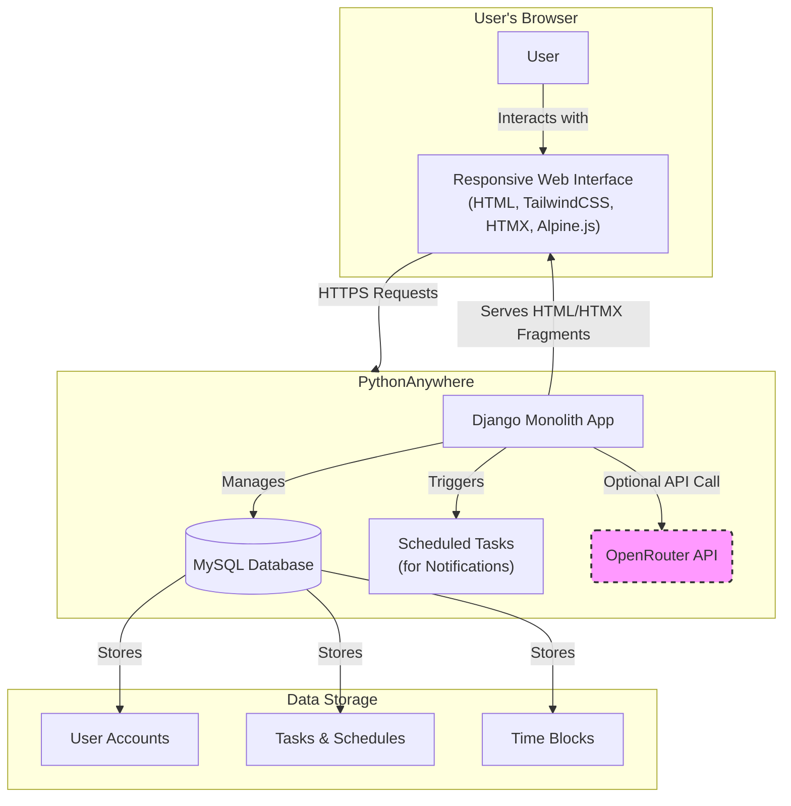

# Intelligent Task Planner Fullstack Architecture Document

## Introduction

This document outlines the complete fullstack architecture for the Intelligent Task Planner, including backend systems, frontend implementation, and their integration. It serves as the single source of truth for AI-driven development, ensuring consistency across the entire technology stack.

This unified approach combines what would traditionally be separate backend and frontend architecture documents, streamlining the development process for this modern, HTMX-driven fullstack application.

### Starter Template or Existing Project

The project is greenfield. Its aesthetic and functional direction is defined by the `front-end-spec.md` document, which contains a complete "Focused Calm" design system.

### Change Log

| Date       | Version | Description                 | Author            |
| :--------- | :------ | :-------------------------- | :---------------- |
| 2025-08-02 | 1.0     | Initial architecture draft. | Winston (Architect) |
| 2025-08-05 | 2.0     | Finalized tech stack, added security & accessibility, and updated to reflect new UI/UX spec. | Winston (Architect) |

## High Level Architecture

### Technical Summary

The Intelligent Task Planner will be a **server-side rendered (SSR) monolithic application** built with **Django** and Python. The frontend will be highly interactive but lightweight, leveraging **HTMX** for dynamic updates and **Alpine.js** for client-side micro-interactions, avoiding a complex JavaScript framework. This architecture is explicitly chosen to maximize development speed, simplify the technology stack, and adhere to the strict deployment constraints of PythonAnywhere. The system is designed around a core, testable **scheduling engine** that handles all task-planning logic.

### Platform and Infrastructure Choice

*   **Platform:** **PythonAnywhere**
*   **Key Services:** Web Hosting (WSGI), MySQL Database, Scheduled Tasks (for notifications).
*   **Deployment Regions:** As provided by PythonAnywhere.
*   **Rationale:** This is a hard constraint from the PRD (NFR8). The entire architecture is optimized to perform efficiently within the resource limits of PythonAnywhere's free tier.

### Repository Structure

*   **Structure:** **Monorepo**
*   **Rationale:** As specified in the PRD, a monorepo simplifies development by keeping the Django backend, templates (acting as the frontend), and shared logic in a single repository. It is the most efficient structure for an HTMX-powered application where the backend and frontend are tightly coupled. We will use **UV** for dependency management.

### High Level Architecture Diagram

This diagram illustrates the primary components and user flow.



### Architectural Patterns

*   **Monolithic Architecture:** The entire application is a single, deployable Django project.
    *   _Rationale:_ Drastically simplifies development, testing, and deployment, which is critical for the 4-week MVP timeline and PythonAnywhere target.
*   **Server-Side Rendering (SSR) with HTMX:** The backend generates HTML, not JSON. HTMX requests new HTML fragments to update the UI dynamically.
    *   _Rationale:_ Aligns with the PRD's lean tech stack, minimizes client-side JavaScript, and improves initial page load performance.
*   **Repository Pattern (for Scheduling):** The core scheduling logic will be isolated in a "service" or "repository" layer, decoupled from Django's views.
    *   _Rationale:_ This makes the most complex and high-risk part of the application (the scheduling engine) highly testable with standard Python unit tests, independent of the web framework.
*   **Token-Based Design System:** Styling will be managed via a centralized theme in TailwindCSS, translating the UI/UX spec's design tokens into a maintainable system.
    *   _Rationale:_ Ensures visual consistency and adherence to the "Focused Calm" design system.

## Tech Stack

This table represents the complete and final technology stack for the Intelligent Task Planner MVP. All development must adhere to these specific choices and versions to ensure consistency and compatibility with the PythonAnywhere deployment target.

### Technology Stack Table

| Category                 | Technology                                | Version        | Purpose                                                                | Rationale                                                                                             |
| :----------------------- | :---------------------------------------- | :------------- | :--------------------------------------------------------------------- | :---------------------------------------------------------------------------------------------------- |
| **Backend Language**     | Python                                    | 3.13.1         | Primary language for all backend logic.                                | Specified in PRD; modern, robust, and has excellent support for Django.                               |
| **Backend Framework**    | Django                                    | 5.2.4          | Core web framework for the entire monolithic application.              | Specified in PRD; enables rapid development with its "batteries-included" philosophy.                 |
| **Dependency Mgmt**      | UV                                        | 0.7.13         | Managing and installing Python packages.                               | Specified in PRD for its high performance and modern features.                                        |
| **Database**             | MySQL                                     | 8.0+           | Relational database for all application data.                          | Specified in PRD; fully supported by Django and PythonAnywhere.                                       |
| **Database Connector**   | mysqlclient                               | 2.2.7          | Python MySQL database connector for Django.                            | Official MySQL connector recommended by Django for production use.                                     |
| **Authentication**       | django-allauth                            | 65.10.0        | Handles user registration, login, and verification.                    | Specified in PRD; a comprehensive, secure, and time-saving solution.                                  |
| **Frontend Framework**   | HTMX                                      | 1.9.12         | Enables dynamic, interactive UIs by swapping HTML fragments from the server. | Core technical choice from PRD to avoid heavy client-side JS frameworks.                              |
| **Client-Side Scripting**  | Alpine.js                               | 3.14.0         | Manages small, localized UI interactions (e.g., dropdowns, modals).    | Specified in PRD; the designated "sprinkle" of JS for a lightweight frontend.                           |
| **Styling**              | TailwindCSS                               | 3.4.3          | Utility-first CSS framework for building the UI.                       | Specified in PRD; allows for rapid development and easy implementation of the design tokens.        |
| **Async Tasks**          | Django-Q2                                 | 1.8.0          | Handles background tasks, specifically for sending notifications.      | A simple, effective task queue that integrates well with Django's ORM. Updated to Django-Q2 for better Django 5.x compatibility. |
| **HTTP Client**          | HTTPX                                     | 0.28.1         | Modern async HTTP client for external API calls.                       | High-performance HTTP client for OpenRouter API integration with async support.                       |
| **Backend Testing**      | Pytest & pytest-django                   | 8.4.1 & 4.11.1 | Framework for writing and running all backend unit and integration tests. | Industry standard for Python testing; provides a clean and powerful testing experience.             |
| **Deployment Platform**  | PythonAnywhere                          | Free Tier      | Exclusive hosting platform for the MVP.                                | Hard constraint from the PRD that dictates many architectural choices.                                |
| **External API**         | OpenRouter API                            | N/A            | Provides optional AI-driven scheduling suggestions.                    | Specified in PRD as a non-critical, progressive enhancement.                                          |

## Data Models

The following data models will be implemented using the Django ORM.

### User (Provided by Django & Allauth)

*   **Purpose:** Manages user authentication, sessions, and core profile information.
*   **Relationships:** A `User` has a one-to-many relationship with `Task`, `TimeBlock`, and `PomodoroSession`.

### Task

*   **Purpose:** To store all information related to a single task that a user needs to complete.
*   **Key Attributes:** `user`, `title`, `description`, `deadline`, `priority`, `estimated_hours`, `min_block_size`, `status`, `start_time`, `end_time`, `is_locked`, `actual_hours`.
*   **Relationships:** Belongs to one `User` and can have many `PomodoroSession`s.

### TimeBlock

*   **Purpose:** Stores the blocks of time a user has marked as available for tasks to be scheduled into.
*   **Key Attributes:** `user`, `start_time`, `end_time`, `is_recurring`, `day_of_week`.
*   **Relationships:** Belongs to one `User`.

### PomodoroSession

*   **Purpose:** Logs a completed 25-minute Pomodoro focus session against a specific task.
*   **Key Attributes:** `task`, `start_time`, `end_time`.
*   **Relationships:** Belongs to one `Task`.

## Components

The application is structured as a single Django monolith, with logical separation of concerns.

### Backend Components (Business Logic & Data)

1.  **User & Auth Component:** Manages user identity.
2.  **Task Management Component:** Handles core CRUD logic for tasks.
3.  **Scheduling Engine Service:** Contains the decoupled, testable scheduling algorithm.
4.  **Notification Service:** Manages queuing and sending reminders.
5.  **Productivity Suite Component:** Handles Pomodoro session logging.
6.  **OpenRouter AI Service:** Encapsulates the optional external API integration.

### Frontend Components (Views & Templates)

These are implemented as server-rendered Django Templates with HTMX and Alpine.js.

1.  **Main App Shell & Navigation:** The persistent three-column layout (`base.html`).
2.  **Kanban Board View:** Displays tasks by status with drag-and-drop functionality.
3.  **Interactive Calendar View:** Renders the weekly schedule with manual editing.
4.  **Pomodoro Timer View:** The focused timer interface.
5.  **Reusable Template Partials:** Core building blocks (`GlassCard`, `TaskCard`, `Modal`, etc.) styled according to the design system.

## External APIs (Revised)

### OpenRouter API

*   **Purpose:** To provide optional, AI-powered scheduling suggestions.
*   **Integration Notes:** This is a non-critical, progressive enhancement with a strict 8-second timeout and graceful failure handling.

### SMTP Email Service

*   **Purpose:** To send transactional emails for account verification and notifications.
*   **Integration Notes:** Uses Django's built-in SMTP backend and sends all emails asynchronously via Django-Q2.

## Core Workflows

_(Sequence diagrams for key user flows like Onboarding, Re-optimization, and Kanban updates are defined but omitted here for brevity. See previous conversation turns for full diagrams.)_

## Database Schema (Refined)

The schema includes performance-critical indexes on the `planner_task` and `planner_timeblock` tables to ensure fast queries for the calendar view and scheduling engine.

```sql
-- REFINED SQL Schema for Intelligent Task Planner
-- Version 1.1 - Added performance-critical indexes

-- Task Table
CREATE TABLE `planner_task` (
    `id` INT AUTO_INCREMENT NOT NULL PRIMARY KEY,
    `title` VARCHAR(255) NOT NULL,
    `description` TEXT NULL,
    `deadline` DATETIME(6) NOT NULL,
    `priority` INT NOT NULL,
    `estimated_hours` DOUBLE PRECISION NOT NULL,
    `min_block_size` DOUBLE PRECISION NOT NULL DEFAULT 0.5,
    `status` VARCHAR(20) NOT NULL,
    `start_time` DATETIME(6) NULL,
    `end_time` DATETIME(6) NULL,
    `is_locked` BOOL NOT NULL DEFAULT FALSE,
    `actual_hours` DOUBLE PRECISION NULL,
    `user_id` INT NOT NULL,
    INDEX `planner_task_user_id_idx` (`user_id`),
    CONSTRAINT `planner_task_user_id_fk` FOREIGN KEY (`user_id`) REFERENCES `auth_user` (`id`) ON DELETE CASCADE,
    INDEX `planner_task_status_idx` (`status`),
    INDEX `planner_task_user_id_start_time_end_time_idx` (`user_id`, `start_time`, `end_time`),
    INDEX `planner_task_user_id_priority_deadline_idx` (`user_id`, `priority`, `deadline`)
);

-- TimeBlock Table
CREATE TABLE `planner_timeblock` (
    `id` INT AUTO_INCREMENT NOT NULL PRIMARY KEY,
    `start_time` DATETIME(6) NOT NULL,
    `end_time` DATETIME(6) NOT NULL,
    `is_recurring` BOOL NOT NULL DEFAULT FALSE,
    `day_of_week` INT NULL,
    `user_id` INT NOT NULL,
    INDEX `planner_timeblock_user_id_idx` (`user_id`),
    CONSTRAINT `planner_timeblock_user_id_fk` FOREIGN KEY (`user_id`) REFERENCES `auth_user` (`id`) ON DELETE CASCADE,
    INDEX `planner_timeblock_user_id_start_time_end_time_idx` (`user_id`, `start_time`, `end_time`),
    INDEX `planner_timeblock_user_id_is_recurring_idx` (`user_id`, `is_recurring`)
);

-- PomodoroSession Table
CREATE TABLE `planner_pomodorosession` (
    `id` INT AUTO_INCREMENT NOT NULL PRIMARY KEY,
    `start_time` DATETIME(6) NOT NULL,
    `end_time` DATETIME(6) NOT NULL,
    `task_id` INT NOT NULL,
    INDEX `planner_pomodorosession_task_id_idx` (`task_id`),
    CONSTRAINT `planner_pomodorosession_task_id_fk` FOREIGN KEY (`task_id`) REFERENCES `planner_task` (`id`) ON DELETE CASCADE
);
```

## Source Tree (Revised)

```plaintext
intelligent-task-planner/
├── .gitignore
├── manage.py
├── pyproject.toml
│
├── example/
│   ├── index.html
│   ├── style.css
│   └── app.js
│
├── intelligent_task_planner/
│   ├── settings.py
│   ├── urls.py
│   └── ...
│
└── planner/
    ├── models.py
    ├── forms.py
    ├── views.py
    ├── urls.py
    │
    ├── services/
    │   ├── scheduling_engine.py
    │   └── ...
    │
    ├── static/
    │   └── ...
    │
    ├── templates/
    │   └── planner/
    │       ├── base.html
    │       ├── dashboard.html
    │       └── partials/
    │           └── ...
    │
    └── tests/
        ├── test_models.py
        └── test_services.py
```

## Infrastructure and Deployment

*   **Tool:** Manual configuration via PythonAnywhere Web UI.
*   **Strategy:** Git-based deployment from the `main` branch.
*   **CI/CD:** GitHub Actions will run the `pytest` suite on every push; failing tests block merges.
*   **Environments:** Local Development and Production on PythonAnywhere.
*   **Rollback:** `git revert` followed by a `git pull` on the server.

## Error Handling Strategy

*   **Model:** Standard Python exceptions, with custom exceptions for business logic.
*   **User-Facing Errors:** HTMX will be used to deliver targeted, user-friendly error messages into the UI without full page reloads.
*   **Logging:** Django's built-in logging, configured to include user context.
*   **Transactions:** All multi-step database operations will be wrapped in `transaction.atomic()` to ensure data integrity.

## Security

*   **Authentication & Authorization:** Handled by `django-allauth`. All sensitive views will be protected and will verify data ownership.
*   **Input Validation:** All user input will be validated via Django Forms to prevent injection attacks. No raw SQL is permitted.
*   **Secrets Management:** `django-environ` will be used to load secrets from environment variables; no secrets in source code.
*   **Django Protections:** CSRF, XSS, and Clickjacking protections will be enabled and enforced.

## Coding Standards (Revised)

### Core Standards

*   **Languages & Runtimes:** Python 3.13.1, Django 5.2.4.
*   **Style & Linting:** All Python code **must** be formatted and linted using **`ruff`**.
*   **Test Organization:** Tests **must** be located in the `tests/` directory of the `planner` app.

### Critical Rules

*   **UI Implementation Mandate:** The frontend UI **must** be a faithful implementation of the "Focused Calm" design system defined in `front-end-spec.md`. All styling **must** be achieved by configuring the design tokens in `tailwind.config.js`.
*   **No Direct ORM Calls in Views:** All business logic **must** be handled in the `services/` directory.
*   **Use Asynchronous Tasks for I/O:** Email sending **must** be executed asynchronously using Django-Q2.
*   **Environment Variables:** Secrets **must not** be hardcoded.
*   **Atomic Transactions:** Multi-write database operations **must** be atomic.

### Accessibility Standards

*   **Semantic HTML:** Use appropriate HTML5 elements for their intended purpose.
*   **Form Labeling:** Every form input **must** have an associated `<label>`.
*   **Keyboard Navigability:** All interactive elements **must** be keyboard-accessible.
*   **Focus Indicators:** Do not remove default browser focus indicators without a clear custom alternative.

## Test Strategy and Standards

*   **Approach:** Test-driven, especially for the `Scheduling Engine`, which requires 90%+ unit test coverage.
*   **Pyramid:** Strong focus on Unit and Integration tests.
*   **Frameworks:** `pytest` and `pytest-django`.
*   **Infrastructure:** Django's test client with an in-memory SQLite database for test runs.