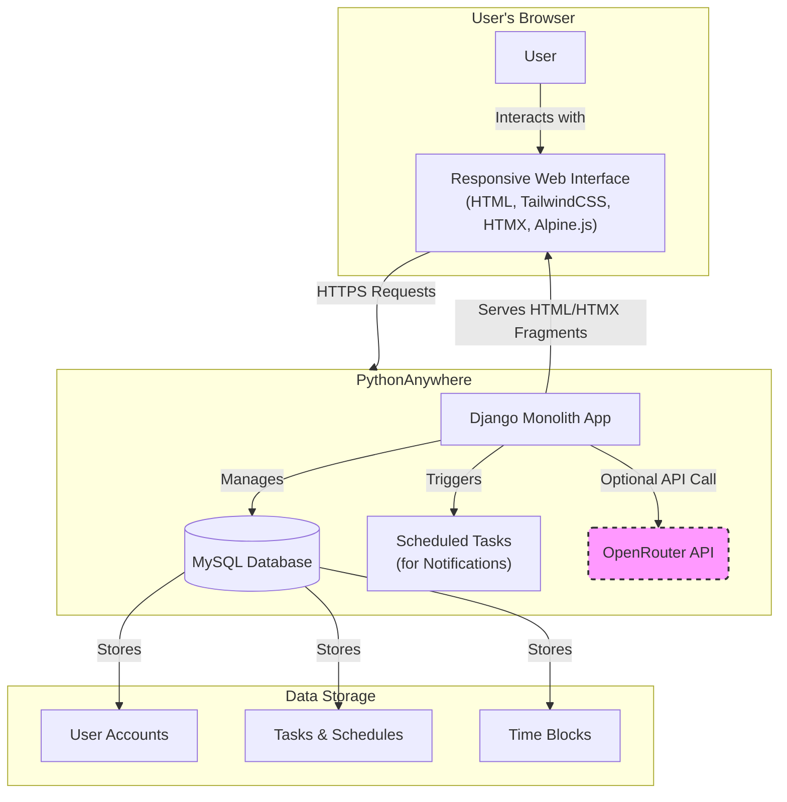

# High Level Architecture

### Technical Summary

The Intelligent Task Planner will be a **server-side rendered (SSR) monolithic application** built with **Django** and Python. The frontend will be highly interactive but lightweight, leveraging **HTMX** for dynamic updates and **Alpine.js** for client-side micro-interactions, avoiding a complex JavaScript framework. This architecture is explicitly chosen to maximize development speed, simplify the technology stack, and adhere to the strict deployment constraints of PythonAnywhere. The system is designed around a core, testable **scheduling engine** that handles all task-planning logic.

### Platform and Infrastructure Choice

*   **Platform:** **PythonAnywhere**
*   **Key Services:** Web Hosting (WSGI), MySQL Database, Scheduled Tasks (for notifications).
*   **Deployment Regions:** As provided by PythonAnywhere.
*   **Rationale:** This is a hard constraint from the PRD (NFR8). The entire architecture is optimized to perform efficiently within the resource limits of PythonAnywhere's free tier.

### Repository Structure

*   **Structure:** **Monorepo**
*   **Rationale:** As specified in the PRD, a monorepo simplifies development by keeping the Django backend, templates (acting as the frontend), and shared logic in a single repository. It is the most efficient structure for an HTMX-powered application where the backend and frontend are tightly coupled. We will use **UV** for dependency management.

### High Level Architecture Diagram

This diagram illustrates the primary components and user flow.

### Architectural Patterns

*   **Monolithic Architecture:** The entire application is a single, deployable Django project.
    *   _Rationale:_ Drastically simplifies development, testing, and deployment, which is critical for the 4-week MVP timeline and PythonAnywhere target.
*   **Server-Side Rendering (SSR) with HTMX:** The backend generates HTML, not JSON. HTMX requests new HTML fragments to update the UI dynamically.
    *   _Rationale:_ Aligns with the PRD's lean tech stack, minimizes client-side JavaScript, and improves initial page load performance.
*   **Repository Pattern (for Scheduling):** The core scheduling logic will be isolated in a "service" or "repository" layer, decoupled from Django's views.
    *   _Rationale:_ This makes the most complex and high-risk part of the application (the scheduling engine) highly testable with standard Python unit tests, independent of the web framework.
*   **Token-Based Design System:** Styling will be managed via a centralized theme in TailwindCSS, translating the UI/UX spec's design tokens into a maintainable system.
    *   _Rationale:_ Ensures visual consistency and adherence to the "Focused Calm" design system.

