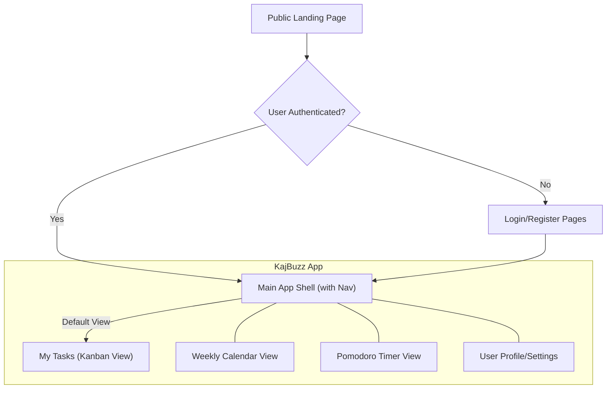
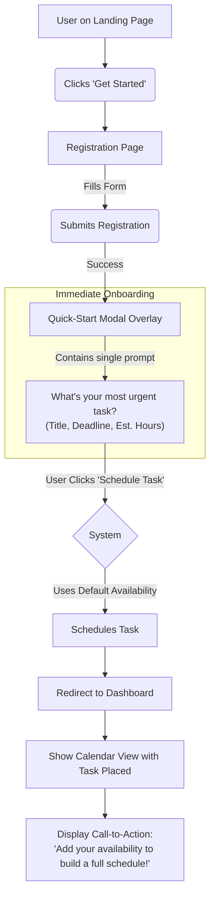

# Intelligent Task Planner Project UI/UX Specification

## Introduction

This document defines the user experience goals, information architecture, user flows, and visual design specifications for the **Intelligent Task Planner**'s user interface. It serves as the foundation for visual design and frontend development, ensuring a cohesive and user-centered experience.

### Overall UX Goals & Principles

**Target User Personas**
*   **Primary:** University students (undergraduate and graduate) who are tech-savvy but time-poor, seeking to reduce the cognitive load of managing a complex academic schedule.

**Usability Goals**
*   **Clarity:** The user should understand their schedule at a glance.
*   **Efficiency:** Core actions like adding a task or rescheduling should be fast and intuitive.
*   **Empowerment:** The user should feel in control of their time, not managed by the tool.

**Core Design Principles**
1.  **Aesthetic Integrity:** The final product must be a faithful implementation of the "Focused Calm" design system defined within this document, featuring a clean aesthetic, soft shadows, and refined glass morphism.
2.  **Simplicity First:** Prioritize a clean, uncluttered interface. Every element on the screen must serve a clear purpose.
3.  **Progressive Disclosure:** Show only what is necessary for the current context, revealing more complex options as needed.
4.  **Immediate Feedback:** Every user action (a click, a drag-and-drop) must result in an immediate and clear visual response.

### Change Log

| Date | Version | Description | Author |
| :--- | :--- | :--- | :--- |
| 2025-08-02 | 1.0 | Initial UI/UX Spec draft created from PRD. | Sally (UX) |
| 2025-08-05 | 2.0 | Replaced `example/` folder dependency with a self-contained "Focused Calm" design system. | Winston (Architect) |

## Information Architecture (IA)

### Site Map / Screen Inventory

The site map illustrates the primary user pathways through the application, from initial landing to core authenticated views.

### Navigation Structure

This definitive version includes a crucial "My Tasks" link to serve as the user's primary navigational anchor, ensuring they can always return to their main dashboard.

*   **Main Application Layout:** The application will feature a persistent three-part layout:
    *   **Left Sidebar (Primary Navigation & Actions):** This is the user's command center.
        *   **+ Add Task** (Primary Action Button)
        *   **My Tasks** (Navigation Link)
        *   **Calendar** (Navigation Link)
        *   **(Future) Analytics** (Navigation Link)
    *   **Center Content Area (Main View):**
        *   **Default View:** Upon login, this area will render the **My Tasks (Kanban Board)**.
    *   **Right Sidebar (Contextual Widgets):**
        *   An "Upcoming Tasks" widget.
        *   An optional mini Pomodoro timer widget.

*   **Top Header / User Navigation:** A minimal top header containing the brand, user profile menu (Settings/Logout), and theme toggle.

## User Flows

### Flow: First-Time User Onboarding & Scheduling

*   **User Goal:** To sign up and see their most urgent task scheduled on a calendar with the absolute minimum number of steps.
*   **Entry Points:** Clicking "Get Started" or "Start Planning" from the landing page.
*   **Success Criteria:** The user has an account and can see their single most important task scheduled, confirming the app's core value proposition within seconds of signing up.

**Flow Diagram:**

## Wireframes & Mockups

This specification, particularly the Branding & Style Guide section, now serves as the definitive source of truth for the application's visual design, replacing external mockups or reference code for the MVP.

## Component Library / Design System

### Design System Approach
We will implement a practical, token-based design system. All styling will be driven by a set of **Design Tokens** (colors, fonts, spacing) defined below and configured in the `tailwind.config.js` file.

### 1. Design Tokens (The Foundation)
*   **Colors:** The full light and dark mode color palettes defined in the Style Guide below will be configured in `tailwind.config.js`.
*   **Typography:** Font families, sizes, and weights will be configured as tokens.
*   **Spacing, Border Radius, & Shadows:** A consistent scale based on an 8px grid will be mapped to the TailwindCSS theme.

### 2. Component Hierarchy
*   **Level 1: Atoms:** `Button`, `Badge`, `ProgressBar`, `FormInput`, `FormSelect`, `Icon`.
*   **Level 2: Molecules:** `GlassCard`, `SolidCard`, `TaskCard`, `Modal`.
*   **Level 3: Organisms:** `KanbanColumn`, `KanbanBoard`.

## Branding & Style Guide

### Visual Identity & Theme Strategy
The aesthetic is "Focused Calm": a modern, minimalist interface that feels clean and professional. A dual-theme (light/dark) system will be implemented using TailwindCSS's dark mode class strategy, controlled by a theme-toggle component.

### Color Palette

**Light Theme**
| Role | Color Name | Hex Code | Usage |
| :--- | :--- | :--- | :--- |
| Background | `bg-primary` | `#F8F9FA` | Main app background |
| Surface | `bg-surface` | `#FFFFFF` | Card backgrounds, modals |
| Primary | `primary` | `#4A90E2` | Buttons, links, active states |
| Text | `text-primary` | `#212529` | Main text color |
| Text Muted | `text-secondary` | `#6C757D` | Secondary text, placeholders |
| Border | `border` | `#DEE2E6` | Card borders, dividers |

**Dark Theme**
| Role | Color Name | Hex Code | Usage |
| :--- | :--- | :--- | :--- |
| Background | `bg-primary` | `#121212` | Main app background |
| Surface | `bg-surface` | `#1E1E1E` | Card backgrounds, modals |
| Primary | `primary` | `#58A6FF` | Buttons, links, active states |
| Text | `text-primary` | `#E0E0E0` | Main text color |
| Text Muted | `text-secondary` | `#8B949E` | Secondary text, placeholders |
| Border | `border` | `#30363D` | Card borders, dividers |

### Typography
*   **Font Family:** "Inter" (from Google Fonts) will be used for all UI text for its excellent readability.
*   **Typographic Scale:**
    | Element | Font Size | Font Weight |
    | :--- | :--- | :--- |
    | H1 | 2.5rem (40px) | 700 (Bold) |
    | H2 | 2rem (32px) | 700 (Bold) |
    | H3 | 1.5rem (24px) | 600 (Semi-bold) |
    | Body | 1rem (16px) | 400 (Regular) |
    | Small | 0.875rem (14px) | 400 (Regular) |

### Spacing & Layout
*   **Grid System:** An 8px grid system will be used. Spacing tokens in Tailwind will be multiples of 8px (e.g., `space-2` = 8px, `space-4` = 16px).
*   **Layout:** The three-column layout will use generous padding and whitespace to feel uncluttered.

### Core Element Styles
*   **Buttons:** `border-radius: 8px`, subtle `box-shadow` on hover, and a soft transition effect.
*   **Cards (`SolidCard`):** `border-radius: 12px`, a soft `box-shadow`, and a 1px solid border.
*   **Glass Morphism (`GlassCard`):** This effect will be retained for key elements like the nav bar and hero sections. It will be implemented with a semi-transparent blurred background (`backdrop-blur`) and a subtle white border to create a sense of depth.

## Accessibility Requirements

### Compliance Target
*   **Standard:** Web Content Accessibility Guidelines (WCAG) 2.1, Level AA.

### Component-Specific Accessibility Requirements
*   **Forms & Modals:** Must have proper label association, focus trapping, and screen reader announcements.
*   **Kanban Board:** Drag-and-drop must have a keyboard-only alternative.
*   **Colors:** All color combinations in both themes must pass the 4.5:1 contrast ratio.

## Responsiveness Strategy

### Mobile-First Approach
Components will be styled for mobile by default, with responsive prefixes (`md:`, `lg:`) used for larger screens.

### Three-Column Layout Adaptation Strategy
*   **Mobile:** Center content is visible by default. Left and Right sidebars are hidden off-canvas and toggled by header icons.
*   **Tablet (`md`):** Left sidebar becomes persistently visible (condensed). Right sidebar remains off-canvas.
*   **Desktop (`lg`):** The full three-column layout is persistently visible.