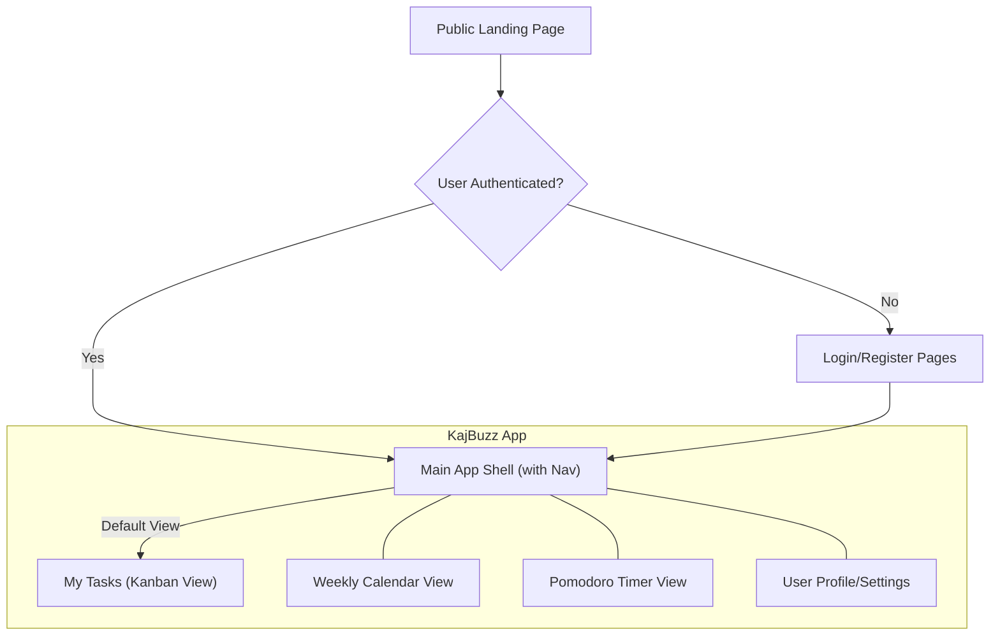

# Information Architecture (IA)

### Site Map / Screen Inventory

The site map illustrates the primary user pathways through the application, from initial landing to core authenticated views.

### Navigation Structure

This definitive version includes a crucial "My Tasks" link to serve as the user's primary navigational anchor, ensuring they can always return to their main dashboard.

*   **Main Application Layout:** The application will feature a persistent three-part layout:
    *   **Left Sidebar (Primary Navigation & Actions):** This is the user's command center.
        *   **+ Add Task** (Primary Action Button)
        *   **My Tasks** (Navigation Link)
        *   **Calendar** (Navigation Link)
        *   **(Future) Analytics** (Navigation Link)
    *   **Center Content Area (Main View):**
        *   **Default View:** Upon login, this area will render the **My Tasks (Kanban Board)**.
    *   **Right Sidebar (Contextual Widgets):**
        *   An "Upcoming Tasks" widget.
        *   An optional mini Pomodoro timer widget.

*   **Top Header / User Navigation:** A minimal top header containing the brand, user profile menu (Settings/Logout), and theme toggle.

