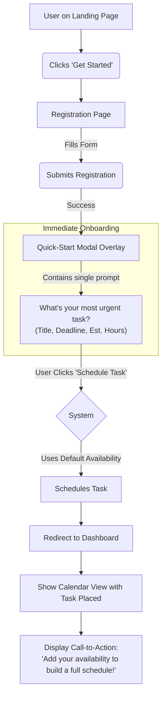

# User Flows

### Flow: First-Time User Onboarding & Scheduling

*   **User Goal:** To sign up and see their most urgent task scheduled on a calendar with the absolute minimum number of steps.
*   **Entry Points:** Clicking "Get Started" or "Start Planning" from the landing page.
*   **Success Criteria:** The user has an account and can see their single most important task scheduled, confirming the app's core value proposition within seconds of signing up.

**Flow Diagram:**


